Gestion de Projet 

# Qu'est ce qu'un projet ?

## Définitions

### ISO 100006

ISO 10006 définit un projet comme : 
un processus unique qui consiste en un ensemble d'activités coordonnées et maîtrisées
comportant des dates de début et de fin,
entrepris dans le but d'atteindre un objectif
conforme à des exigences  spécifiques,
incluant les contraintes de délais, de coûts et de  ressource

### PMI 

Un projet est une entreprise temporaire 
initiée dans le but de fournir un produit, un service ou un résultat unique

### ChatGTP

La gestion de projet est l’ensemble des méthodes, outils et pratiques
qui permettent de planifier, organiser, piloter et contrôler
la réalisation d’un projet afin d’atteindre des
objectifs précis, dans un délai défini et
avec des ressources limitées (humaines, matérielles, financières).

## Qu'est ce qu'un programme ?

Un programme regroupe plusieurs projets liés par un objectif commun.
Les projets restent autonomes mais leur coordination permet d'obtenir davantage de valeur.

# Comprendre le besoin 

Avant de chercher une solution, il faut comprendre précisément le problème à résoudre.
Une mauvaise compréhension du besoin peut conduire à réaliser parfaitement la mauvaise chose.
Le chef de projet doit donc questionner le demandeur et les utilisateurs.
Il faut distinguer ce qui est réellement nécessaire de ce qui est simplement souhaité.
Cette étape permet d'éviter de partir trop rapidement sur une solution technique

## Besoin ≠ solution

Un besoin décrit ce que l'on cherche à obtenir, tandis qu'une solution décrit comment on va l'obtenir.
Plusieurs solutions peuvent répondre au même besoin.
Commencer par le besoin permet de conserver plusieurs possibilités ouvertes.

## Chaine des pourquoi

La chaîne des « pourquoi ? » permet de remonter du besoin apparent vers sa cause réelle.
On demande plusieurs fois pourquoi une demande est nécessaire.
Chaque réponse permet d'aller un niveau plus profondément dans le problème.
Cette technique permet parfois de découvrir que la solution initialement envisagée n'est pas nécessaire.
Elle aide à construire un projet répondant réellement au problème.

## Formaliser des Exigences

Une exigence décrit précisément ce que le système ou le projet doit permettre de réaliser.
Elle doit être claire, factuelle, mesurable et vérifiable.
Une bonne exigence évite les formulations ambiguës comme « rapide », « simple » ou « performant ».
Il faut également vérifier qu'elle est réaliste et compatible avec les contraintes du projet.
Une exigence doit permettre de déterminer objectivement si le résultat est conforme.

## Use cases / User Stories

Un use case décrit une interaction entre un utilisateur et un système pour atteindre un objectif.
Une user story exprime généralement le besoin du point de vue de l'utilisateur.
Ces outils permettent de partir de l'utilisation réelle plutôt que de la technologie.
Ils permettent également de découper un besoin complexe en éléments plus petits.

Utilisation | Description | Factualisation

## Criteres d'acceptation / DoD

Les critères d'acceptation permettent de vérifier si une fonctionnalité répond au besoin exprimé.
Ils décrivent les conditions qui doivent être respectées pour considérer le résultat comme acceptable.

### Définition of Done

La Definition of Done précise ce que signifie « terminé » pour l'équipe.
Une tâche développée mais non testée peut donc ne pas être considérée comme terminée.
L'objectif est de remplacer « ça devrait être bon » par une vérification objective.

 

# Cadrer un projet 

Le cadrage transforme une idée générale en projet compréhensible et partagé.
On définit notamment les objectifs, le périmètre, les acteurs et les principales contraintes.
Cette étape permet de répondre à la question : « Qu'allons-nous réellement faire ? »
Elle permet également de préciser ce qui ne fait pas partie du projet.
Un bon cadrage réduit fortement les incompréhensions futures.

## Objectifs

Un objectif décrit le résultat que le projet doit atteindre.
Il doit être suffisamment précis pour permettre de vérifier son atteinte.
On peut utiliser la méthode SMART : Spécifique, Mesurable, Atteignable, Réaliste et Temporellement défini.
Un objectif doit également être compris de la même manière par les différentes parties prenantes.
Un projet sans objectif clair ne peut pas être correctement piloté.

## Périmètre

Le périmètre définit ce qui est inclus dans le projet et ce qui ne l'est pas.
Il concerne notamment les fonctionnalités, produits, services ou activités à réaliser.
Le hors-périmètre est tout aussi important que le périmètre.
Sans limite claire, le projet risque de s'étendre progressivement.
Ce phénomène est souvent appelé **scope creep**.

## Parties prenantes 

Les parties prenantes sont les personnes ou organisations concernées par le projet.
Elles peuvent utiliser le résultat, le financer, le réaliser ou être impactées par celui-ci.
Elles peuvent avoir des attentes et des intérêts différents.
Il est  important d'identifier les acteurs importants dès le début.
Une partie prenante oubliée peut devenir une source importante de problème.

## Business Model Canvas 

Le Business Model Canvas permet de représenter simplement le fonctionnement économique d'un projet ou d'une activité.
Il permet notamment d'identifier les clients, la proposition de valeur et les ressources nécessaires.
Il donne une vision globale du fonctionnement du projet.
Il peut être utilisé pour tester rapidement la cohérence d'une idée.
C'est un outil de cadrage et de réflexion.

## Qualité cout délai 

Un projet doit généralement arbitrer entre plusieurs contraintes.
Modifier le périmètre peut avoir un impact sur le coût, le délai ou la qualité.
Réduire fortement le délai peut nécessiter davantage de ressources ou une réduction du périmètre.
Le rôle du chef de projet est notamment de rendre ces arbitrages visibles.

# Construire le projet 

Une fois le projet cadré, il faut transformer l'objectif en travail réalisable.
On découpe progressivement le projet en livrables puis en tâches.
Chaque tâche doit être suffisamment précise pour pouvoir être estimée et attribuée.
On identifie également les dépendances entre les tâches.
Cette décomposition constitue la base du planning et du budget.

## WBS - Work Breakdown Structure

Le WBS consiste à décomposer le projet en éléments de plus en plus petits.
On part du projet global puis on descend vers les livrables et les tâches.
Le découpage peut être organisé par fonctionnalités, produits ou phases.
Le WBS permet de vérifier que le travail nécessaire n'a pas été oublié.
Il constitue souvent le point de départ du planning, des estimations et du budget.

## Livrables

Un livrable est un résultat concret produit par le projet.
Il peut s'agir d'un document, d'un logiciel, d'un prototype, d'une infrastructure ou d'une formation.
Les livrables permettent de rendre l'avancement visible.
Chaque livrable doit pouvoir être vérifié et accepté.
Un projet avance donc non seulement par des tâches réalisées, mais surtout par des résultats produits.

## Taches

Une tâche représente une unité de travail à réaliser.
Elle doit avoir un objectif clair et idéalement produire un résultat identifiable.
Une tâche trop importante est difficile à estimer et à suivre.
Une tâche trop petite peut générer une complexité de suivi inutile.
Le bon niveau de découpage dépend du projet et de l'équipe.

Une tache à :
- Durée
- Dépendances
- Cout
- Porteur

## Dépendances

Certaines tâches ne peuvent commencer qu'après la réalisation d'autres tâches.
Par exemple, il faut généralement concevoir une base de données avant de pouvoir l'utiliser.
Ces relations entre tâches constituent les dépendances.
Elles ont un impact direct sur le planning du projet.
Les identifier permet notamment de détecter les activités qui peuvent être réalisées en parallèle.

## Estimation des taches

Estimer consiste à prévoir les ressources nécessaires pour réaliser une tâche.
Une estimation n'est pas une certitude mais une hypothèse basée sur les informations disponibles.
Elle dépend notamment de la complexité, de l'expérience et des incertitudes.
Plus une tâche est précise et connue, plus son estimation peut être fiable.
Les estimations doivent donc être réévaluées lorsque les informations évoluent.

## Planing poker

Le Planning Poker est une méthode collaborative d'estimation utilisée notamment dans les équipes agiles.
Chaque participant estime individuellement la complexité relative d'une tâche.
Les valeurs sont souvent basées sur une suite comme 1, 2, 4, 8, 16, 32.
Les écarts entre les estimations permettent de faire émerger les discussions et les hypothèses cachées.
L'objectif principal est de construire une estimation collective, pas de produire une fausse précision.

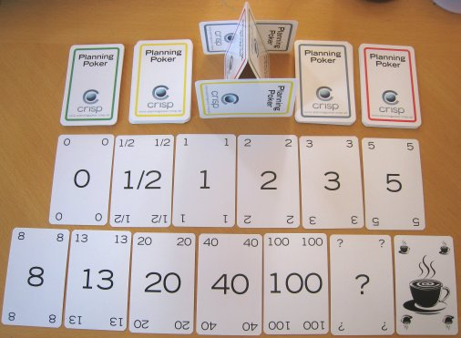

## Budgets 

Le budget permet d'estimer et de suivre les dépenses nécessaires au projet.
Il peut inclure les personnes, logiciels, matériels, prestations et infrastructures.
Les dépenses d'investissement (CAPEX) sont distinguées des dépenses de fonctionnement (OPEX).
Le budget prévisionnel doit être comparé régulièrement aux dépenses réelles.
Un dépassement doit être expliqué et, si nécessaire, faire l'objet d'un arbitrage.

## Plan de financement 

Le plan de financement explique comment le projet sera financièrement couvert.
Il identifie les différentes sources de financement disponibles.
Il peut s'agir d'un budget interne, d'un client, d'une subvention ou d'un financement externe.
Il faut vérifier que les ressources financières sont disponibles au bon moment.
Un projet peut donc être techniquement réalisable mais financièrement impossible.

# Planifier 

La planification transforme le travail identifié en une représentation temporelle du projet.
Elle permet de déterminer quand les activités peuvent commencer et se terminer.
Elle prend en compte les durées, les dépendances et les ressources disponibles.
Le planning sert également de référence pour mesurer les écarts.
Il doit être considéré comme un outil de pilotage et non comme une prédiction parfaite.

## GANTT 

Le diagramme de Gantt représente les tâches du projet sur une échelle de temps.
Il permet de visualiser les dates de début et de fin des activités.
On peut y représenter les dépendances, les chevauchements, les jalons et l'avancement.
Il donne rapidement une vision globale du projet.
C'est également un outil de communication très efficace avec les parties prenantes.

Taches
- Durée
- Date de début et de fin
- Chevauchements
- Chemin critique
- Avancement 

## Jalons 

Un jalon représente un événement important du projet plutôt qu'une durée de travail.
Il peut correspondre à une validation, une décision ou une livraison importante.
Exemples : « prototype validé », « recette terminée », « mise en production ».
Les jalons permettent de découper le projet en grandes étapes.
Ils servent également de points de contrôle pour le pilotage

## Chemin critique 

Le chemin critique est la succession de tâches qui détermine la durée minimale du projet.
Une tâche située sur ce chemin dispose généralement de peu ou pas de marge.
Un retard sur une tâche critique peut donc retarder la fin du projet.
À l'inverse, un retard sur une tâche disposant de marge peut parfois être absorbé.
Identifier le chemin critique permet de concentrer l'attention sur les activités les plus sensibles.

## Roadmap 

Une roadmap présente les grandes étapes et orientations du projet dans le temps.
Elle est généralement moins détaillée qu'un Gantt.
Elle permet de communiquer une vision globale aux utilisateurs, clients ou dirigeants.
Elle peut présenter des versions, fonctionnalités, objectifs ou grandes échéances.

# Organiser l'équipe

Un projet est réalisé par des personnes ayant des compétences, des responsabilités et des contraintes différentes.
L'organisation de l'équipe doit permettre à chacun de comprendre son rôle.
Il faut également faciliter la communication et la prise de décision.
Les difficultés humaines peuvent avoir autant d'impact que les difficultés techniques.
La gestion de projet est donc aussi une gestion des interactions humaines.

## Etapes de la vie d'un groupe 

Une équipe ne devient pas immédiatement performante lorsqu'elle est créée.
Elle commence par se découvrir (Forming), puis peut traverser une phase de tensions (Storming).
Elle établit ensuite progressivement ses règles de fonctionnement (Norming).
Elle peut alors atteindre une phase de fonctionnement efficace (Performing).
Enfin, lorsque le projet se termine, l'équipe se sépare ou évolue (Adjourning).

Forming
Storming
Norming
Performing/Team
Adjourning 

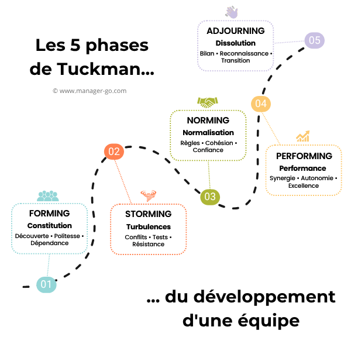

## RACI 

La matrice RACI permet de clarifier les responsabilités sur les activités du projet.
Une tâche importante doit avoir un responsable clairement identifié.
Le RACI permet d'éviter les situations où « tout le monde pensait que quelqu'un d'autre s'en occupait ».

Responsible: réalise le travail
Accountable: porte la responsabilité finale
Consulted  : est sollicité pour donner son avis
Informed   : doit être tenu informé

# Piloter le projet

Planifier ne suffit pas : il faut régulièrement comparer la situation réelle avec ce qui était prévu.
Le pilotage consiste à mesurer l'avancement et à identifier les écarts.
Le chef de projet doit ensuite décider ou proposer les actions nécessaires.
Il doit également communiquer ces informations aux bonnes parties prenantes.
Piloter signifie donc observer, comprendre, décider et agir.

## Avancement 

L'avancement mesure la progression réelle du projet.
Il faut distinguer le travail commencé, terminé et réellement validé.
Un projet peut avoir réalisé beaucoup de tâches sans avoir produit les livrables attendus.
L'avancement doit donc être mesuré à partir de résultats vérifiables.
Les indicateurs doivent permettre de détecter suffisamment tôt les dérives.

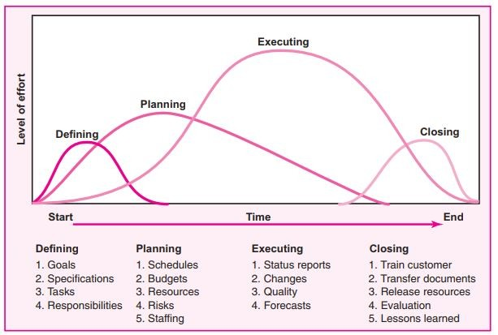

## Qualité / Cout / Délai 

Le pilotage doit vérifier que le résultat respecte le niveau de qualité attendu.
Il faut également suivre les dépenses par rapport au budget prévu.
Le planning permet de comparer les dates prévues et les dates réelles.
Ces trois dimensions sont liées et peuvent nécessiter des arbitrages.
Une bonne gestion consiste à rendre ces arbitrages explicites plutôt qu'à les subir.

## Changements 

Les changements sont normaux dans un projet : besoin, réglementation, technologie ou contraintes peuvent évoluer.
Un changement ne doit cependant pas être intégré automatiquement sans analyse.
Il faut étudier son impact sur le périmètre, le coût, le délai, la qualité et les risques.
Une décision doit ensuite être prise et communiquée aux personnes concernées.
Le changement doit enfin être intégré dans les documents et le planning du projet.
Le pire qui puisse arriver, c'est un patch rapide bricolé en prod et référencé nulle part. Ca va fonctionner jusqu'à la prochaine mise à jour, et personne ne comprendra pourquoi la mise à jour est 'fail'.

## Risques 

Un risque est un événement incertain qui pourrait avoir un impact sur le projet.
On évalue généralement sa probabilité et son impact.
Les risques importants doivent avoir une stratégie de traitement et un responsable.
On peut notamment éviter, réduire, transférer ou accepter un risque.
Le registre des risques doit être régulièrement réévalué pendant le projet.

### Qu'est ce qu'un risque ?

Un risque est possible, alors qu'un problème est déjà arrivé.
« Le fournisseur pourrait être en retard » est un risque.
« Le fournisseur est en retard » est désormais un problème.
Cette distinction est importante car les actions ne sont pas les mêmes.
Un risque peut être anticipé, alors qu'un problème doit être traité.

Impact
Probabilité
Remédiation
  Acepter/ Transférer/Mitiger/Refuser 

### Revues de risques projets 
Une revue de risques consiste à réexaminer régulièrement les risques du projet.
De nouveaux risques peuvent apparaître au cours du projet.
La probabilité ou l'impact d'un risque existant peuvent également évoluer.
L'équipe vérifie les actions prévues et leur efficacité.
Cette activité permet d'éviter que le registre des risques devienne simplement un document oublié.

# Produire et Valider 

Un projet ne consiste pas seulement à réaliser des tâches : il doit produire des résultats utilisables.
Chaque résultat doit être vérifié par rapport aux exigences définies.
La validation permet de s'assurer que le projet répond réellement au besoin.
Les tests doivent être prévus suffisamment tôt pour éviter les mauvaises surprises.
La fin d'une tâche doit donc être associée à un résultat vérifiable.

## Livrables

Les livrables sont les résultats produits et remis par le projet.
Ils doivent être identifiés dès que possible.
Chaque livrable possède généralement des critères permettant de déterminer s'il est acceptable.
Le suivi des livrables permet de mesurer l'avancement réel du projet.
Un livrable non accepté ne doit pas nécessairement être considéré comme terminé.

## Definition of Done

La Definition of Done décrit les conditions nécessaires pour considérer un élément comme terminé.
Elle peut inclure le développement, les tests, la documentation et la validation.
Elle doit être comprise et appliquée de la même manière par toute l'équipe.
Elle évite qu'une personne considère une tâche terminée alors qu'une autre estime qu'elle reste du travail.
Elle apporte une définition commune du mot « fini ».

## Critères d'acceptation

Les critères d'acceptation permettent au client ou à l'utilisateur de vérifier le résultat.
Ils doivent être observables et suffisamment précis.
Ils peuvent être définis avant même le développement ou la réalisation.
Ils servent ensuite de référence lors de la validation.
Un résultat est accepté lorsqu'il satisfait les critères définis.

## Plan de tests

Le plan de tests décrit comment vérifier que le résultat fonctionne correctement.
Il précise notamment ce qui doit être testé et les résultats attendus.
Les tests peuvent porter sur les fonctionnalités, les performances, la sécurité ou l'utilisation.
Un test réussi apporte une preuve, alors qu'une simple affirmation ne suffit pas.
Tester tôt permet de détecter les problèmes avant qu'ils ne deviennent coûteux à corriger.

Les test doivent être automatisés, et faciles à rejouer systématiquement.

# Cycle en V / Agile

Deux grandes approches permettent notamment d'organiser la réalisation d'un projet : une approche séquentielle comme le cycle en V et des approches itératives comme Agile.
Le choix dépend du contexte, du niveau d'incertitude et de la nature du projet.
Le cycle en V cherche notamment à structurer fortement les phases et validations.
L'Agile privilégie des cycles courts et des retours réguliers.
Il ne s'agit pas simplement de choisir une méthode à la mode, mais d'adapter l'organisation au projet.

En entreprise on peut avoir du cycle en V annuel pour la programamtion budgétaire, et une organisation agile au quotidien.

## Cycle en V 

Le cycle en V organise le projet en phases successives de définition, conception, réalisation et validation.
Chaque étape possède généralement une activité de vérification ou de validation associée.
Il peut être adapté lorsque les exigences sont relativement stables et fortement contraintes.
Il permet notamment de conserver une traçabilité entre exigences, réalisation et tests.
Son principal risque est de découvrir tardivement une mauvaise compréhension du besoin.

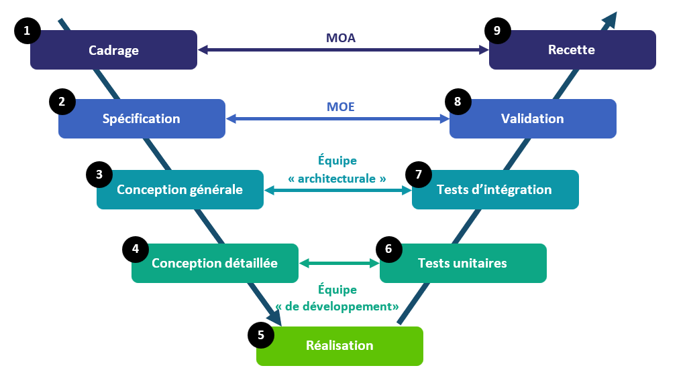

## Effet tunnel 

L'effet tunnel apparaît lorsque l'équipe travaille longtemps sans fournir de résultat visible aux utilisateurs.
Pendant cette période, les utilisateurs ont peu d'occasions de vérifier que le projet répond à leur besoin.
Une erreur découverte à la fin peut alors être coûteuse à corriger.
Les approches itératives cherchent notamment à réduire ce phénomène.
Livrer régulièrement permet d'obtenir du feedback avant qu'il ne soit trop tard.

## Manifeste Agile 

Le Manifeste Agile propose des valeurs et principes pour développer des produits dans des contextes où le besoin peut évoluer.
Il privilégie notamment les interactions, les résultats fonctionnels et la collaboration avec le client.
Agile cherche à obtenir rapidement du feedback et à s'adapter.
Cela ne signifie pas « ne rien planifier » ou « ne rien documenter ».
L'objectif est de conserver suffisamment de structure tout en acceptant l'évolution.

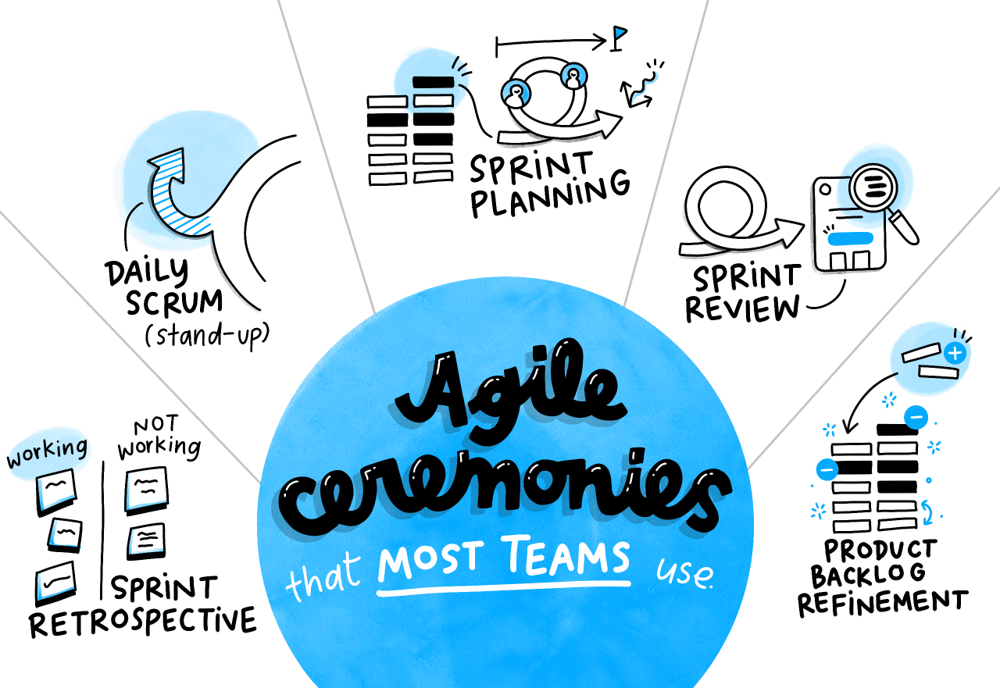

## Sprint

Un sprint est une période de durée fixe pendant laquelle l'équipe réalise un ensemble d'éléments du backlog.
L'objectif est de produire un incrément utilisable du produit.
L'équipe sélectionne les éléments qu'elle pense pouvoir réaliser pendant le sprint.
À la fin, le résultat est présenté et évalué.
Les sprints permettent de travailler par cycles courts plutôt que d'attendre la fin du projet.

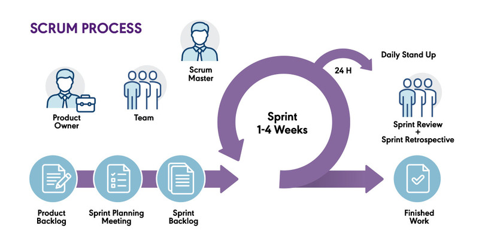

## Backlog 

Le backlog est une liste de taches à faire.
Il peut sagir de fonctionnalités, corrections, améliorations,...
Les éléments sont généralement priorisés en fonction de leur valeur et de leur importance.
Le backlog évolue au fur et à mesure que l'équipe apprend.
Il constitue donc une liste vivante plutôt qu'un cahier des charges figé.

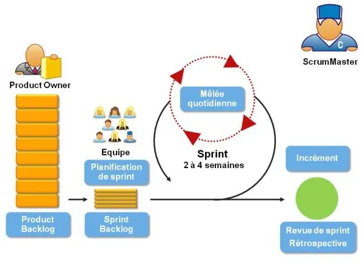

## Roles

Une organisation Agile définit des responsabilités permettant de faciliter la collaboration.
Le Product Owner porte notamment la vision et la priorisation du produit.
L'équipe de développement réalise le produit et contribue aux estimations.
Le Scrum Master facilite le fonctionnement de Scrum et aide l'équipe à résoudre les obstacles.
Ces rôles ne correspondent pas à des titres hiérarchiques.

## Sprint review

La Sprint Review permet de présenter le résultat obtenu pendant le sprint.
Les utilisateurs et parties prenantes peuvent donner leur feedback.
L'équipe peut alors comparer le résultat obtenu avec les attentes.
Les nouvelles informations peuvent conduire à faire évoluer le backlog.
La review crée donc une boucle entre réalisation et besoin.

## Retrospectives

La rétrospective porte principalement sur la manière dont l'équipe travaille.
Elle cherche à identifier ce qui fonctionne bien et ce qui pourrait être amélioré.
L'objectif n'est pas de rechercher un responsable mais de faire progresser l'équipe.
Les décisions prises doivent idéalement conduire à des actions concrètes.
La rétrospective constitue ainsi un mécanisme d'amélioration continue.

 

## Safe Framework

Le mode agile est adapté à des équipes jusqu'à 12 personnes. On parle de double-pizza team.
SAFe est un framework destiné à appliquer des principes agiles à des organisations importantes.
Il cherche notamment à coordonner plusieurs équipes et plusieurs niveaux de planification.
Il introduit des mécanismes supplémentaires de synchronisation et de gouvernance.

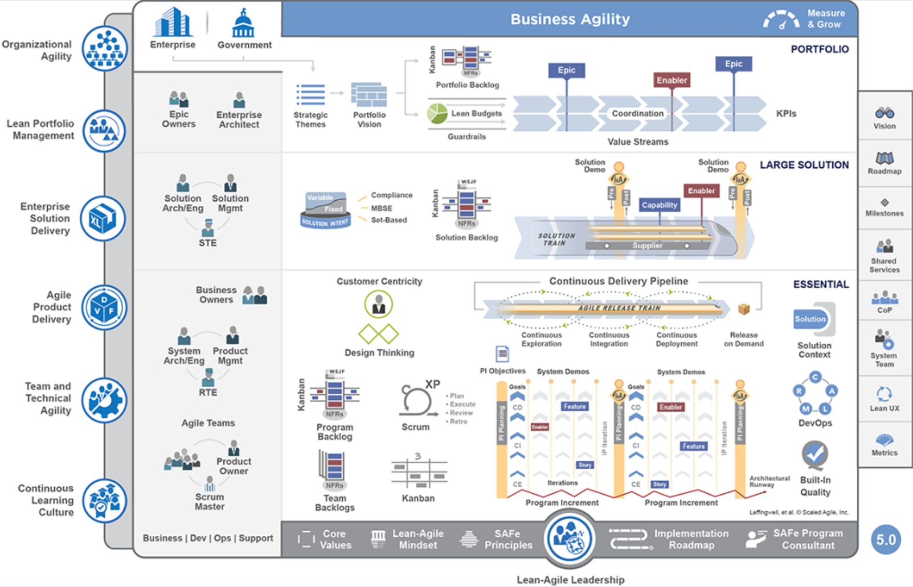

# Kanban

Kanban représente visuellement le travail en cours et son évolution dans le temps.
Les tâches sont généralement déplacées entre différentes colonnes comme À faire → En cours → Terminé.
L'équipe peut ainsi visualiser rapidement les blocages.
La limitation du WIP (Work In Progress) évite de commencer trop de tâches simultanément.
L'objectif est d'améliorer le flux de travail et de terminer les tâches plutôt que d'en accumuler.

# MVP/Roadmap

Un produit évolue généralement progressivement plutôt que d'être construit entièrement dès le premier jour.
On peut commencer par un prototype ou une première version limitée.
Les utilisateurs permettent ensuite de fournir du feedback et d'orienter les versions suivantes.
La roadmap donne une vision des évolutions envisagées.
Cette approche permet de réduire les investissements avant d'avoir vérifié que le produit répond réellement au besoin.

## MVP 

Le Minimum Viable Product est une première version permettant de tester une hypothèse importante auprès de vrais utilisateurs.
Il ne signifie pas « produit bâclé ».
Il doit contenir suffisamment de valeur pour permettre d'apprendre quelque chose.
L'objectif est notamment de vérifier que le besoin identifié existe réellement.
Le MVP permet donc de transformer rapidement des hypothèses en apprentissage.

## Roadmap produit 

La roadmap présente les grandes orientations et évolutions prévues pour le produit.
Elle peut présenter plusieurs versions ou thèmes fonctionnels.
Elle doit rester suffisamment flexible pour intégrer les retours utilisateurs.
Elle est généralement plus stratégique et moins détaillée qu'un planning Gantt.
Elle permet de partager une vision commune de la direction du produit.

## Feedback 

Le feedback est l'information obtenue après avoir présenté ou livré un résultat.
Il peut provenir des utilisateurs, du client, des tests ou des indicateurs d'utilisation.
Un feedback peut confirmer une hypothèse ou révéler un problème.
Il permet d'adapter les prochaines décisions du projet.
Dans une démarche Agile, le feedback constitue une boucle essentielle entre produire et apprendre.

# Amélioration continue 

Un projet ne doit pas seulement chercher à atteindre son objectif : l'équipe peut également améliorer sa manière de travailler.
L'amélioration continue consiste à observer les résultats, identifier les problèmes et expérimenter des améliorations.
Les rétrospectives permettent de faire émerger ces améliorations.
Le PDCA formalise cette démarche sous forme d'un cycle.
L'objectif est que les erreurs et expériences d'un projet profitent aux projets suivants.

## PDCA: Plan do Check Act 

Plan : définir ce que l'on souhaite améliorer et comment le faire.
Do : mettre en œuvre l'action, souvent à petite échelle.
Check : mesurer le résultat obtenu et le comparer à l'objectif.
Act : conserver, adapter ou abandonner l'amélioration selon les résultats.
Le cycle recommence ensuite avec une nouvelle amélioration.

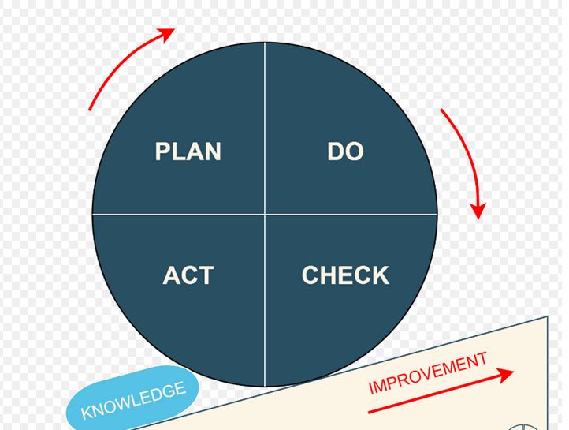

## Retrospectives

a rétrospective permet à l'équipe de prendre du recul sur son fonctionnement.
Le Sailboat permet par exemple d'identifier les éléments qui aident, ralentissent ou menacent l'équipe.
Le Starfish permet de réfléchir à ce qu'il faut commencer, arrêter, continuer, augmenter ou réduire.
L'intérêt principal est de faire émerger quelques actions concrètes.
Une rétrospective utile se termine donc idéalement par des décisions.

Sailboat
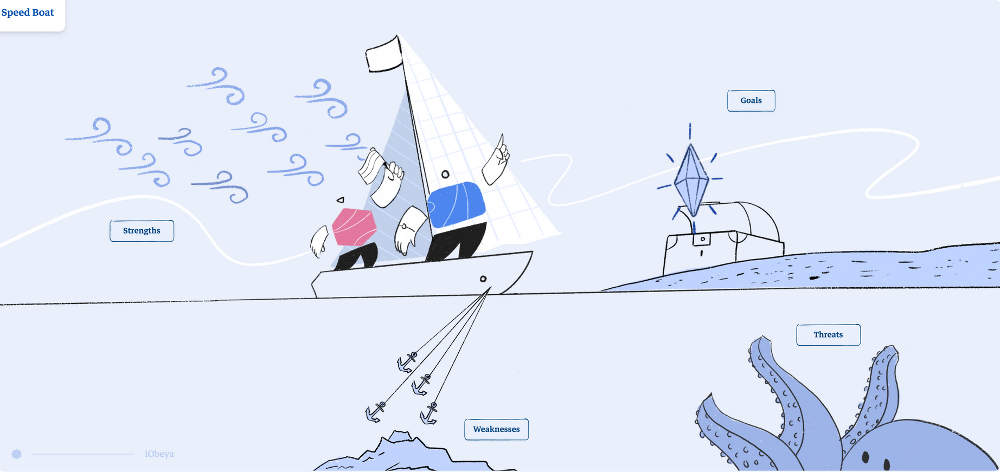

Starfish
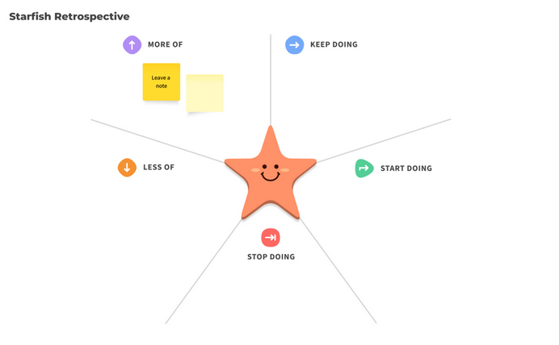

## Niveau de maturité d'un projet 

La maturité décrit la capacité d'une organisation à gérer ses projets de manière structurée et reproductible.
Au niveau 1, les pratiques sont essentiellement informelles et peu documentées.
Aux niveaux suivants, les processus deviennent documentés, répétables puis mesurés avec des indicateurs.
Le niveau 5 correspond à une démarche d'amélioration continue.
L'objectif n'est pas d'être systématiquement au niveau maximal, mais d'adapter le niveau de formalisation au contexte.

1 undocumented
2 Quelques process de management documentés
3 Process de management documentés et répétables
4 Process benchmarkés avec KPI
5 Amélioration continue 

## ROTI 

Le ROTI — Return On Time Invested est une méthode très simple pour évaluer une réunion ou une activité collective.
À la fin, chaque participant estime si le temps passé lui a apporté suffisamment de valeur.
On peut utiliser une échelle simple, par exemple de 1 à 5.
Le résultat permet de détecter les réunions trop longues, inutiles ou mal préparées.
Le ROTI transforme ainsi une impression subjective en signal permettant d'améliorer le fonctionnement de l'équipe.

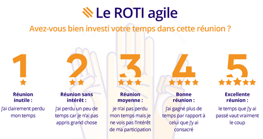

 

